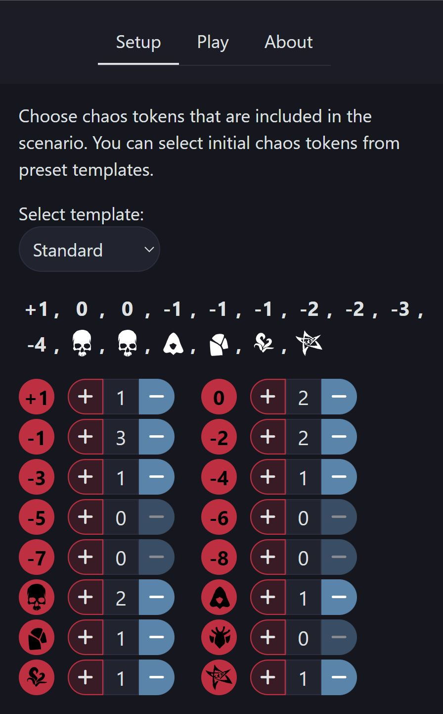
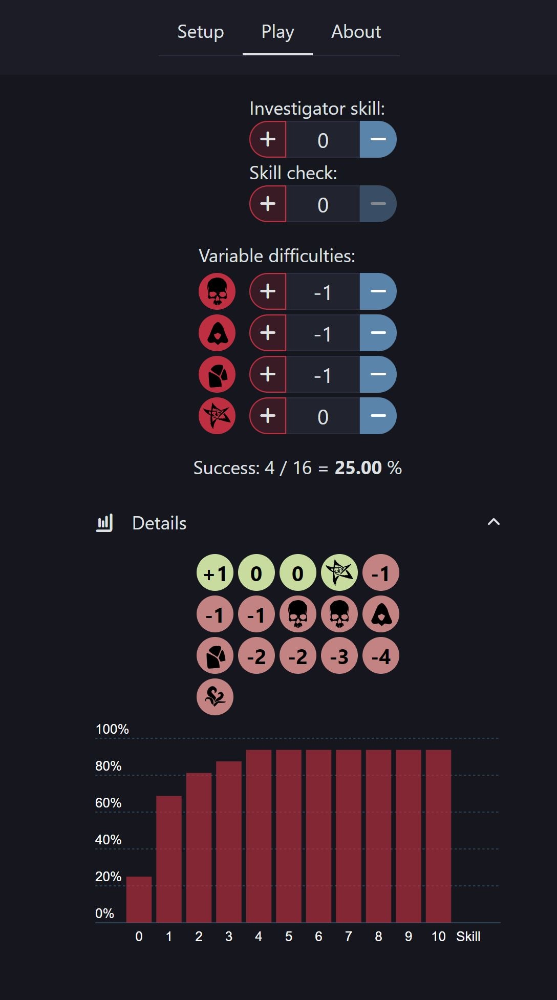

# Arkham horror chaos tokens

This application is made by a board game fan of the Arkham Horror series. Arkham Horror Trading Card Game is the particular board game that this app was made for. The gameplay consists of multiple luck-based "skill checks" which are determined by a few variable values and the set of chaos tokens pulled from the bag of tokens.

The aim is to have a fun tool which can visualize the risks which every player has to evaluate multiple times during the gameplay. The project also serves as a hobby project for learning about Svelte, SvelteKit, Tailwind and SkeletonLabs.

## Example images of the application

### Setup page

Setup page for selecting chaos tokens used in the scenario.

### Gameplay page

Play page for adjusting skill, skill check and chaos token difficulties during the game play. The success chance for beating a check is calculated and success/failure tokens are displayed in details section.

